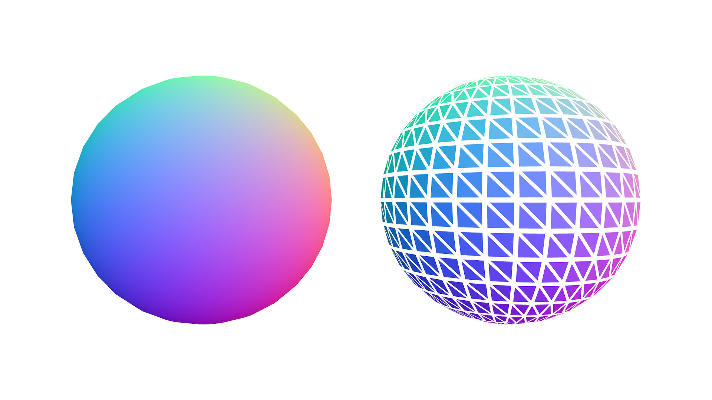

# geom-split-vertices

Creates a new geometry with unique vertices for each face. Useful for flat shading.



## Installation

```bash
npm install geom-split-vertices
```

## Usage

```js
import splitVertices from "geom-split-vertices";
import { sphere } from "primitive-geometry";

const geometry = sphere();
const splitGeometry = splitVertices(geometry.positions, geometry.cells);
// => { positions: Float32Array(9216), cells: Uint32Array(3072) }
```

## API

#### splitVertices(positions, cells): geometry

**Parameters**

- positions: `TypedArray | Array | Array<[x, y, z]>` – simplicial complex geometry positions (eg. `new Float32Array([x, y, z, x, y, z, ...])/new Array(x, y, z, x, y, z, ...)` or `new Array([x, y, z], [x, y, z], ...)`)
- cells: `TypedArray | Array | Array<[x, y, z]>` – simplicial complex geometry cells (eg. `new Uint32Array([a, b, c, a, b, c, ...])/new Array(a, b, c, a, b, c, ...)` or `new Array([a, b, c], [a, b, c], ...)`)

**Returns**

geometry: `{ positions: TypedArray|Array, cells: TypedArray|Array }` - new geometry with unique vertex position for each cell / face.

_Note: Other vertex attributes like normals and uvs are lost and need to be recomputed._

## License

MIT. See [license file](https://github.com/vorg/geom-split-vertices/blob/master/LICENSE.md).
